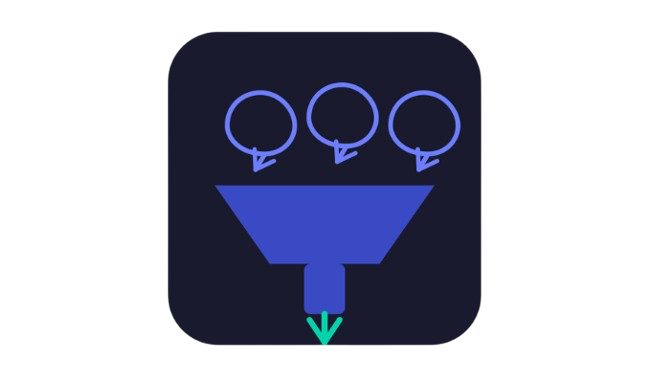

# LoopThru
**Stop scrolling. Start receiving.**

LoopThru is an AI-powered Chrome extension for Discord that watches channels on your behalf and sends you a browser notification only when a message matches your intent. No noise. No endless scrolling. Just the stuff you actually care about.

## The problem
You joined that Discord server for a reason — job postings, game releases, research papers, startup opportunities. But now it's 80% memes, off-topic chat, and noise. You either mute it and miss everything, or stay in and waste hours scrolling.

LoopThru solves this. Type your intent once. It reads every message in the background. You get notified only when it finds a match.

## How it works
1. Open LoopThru from your Chrome toolbar
2. Enter your free Groq API key
3. Type your intent — "internship opportunities", "game releases", "ML research papers"
4. LoopThru monitors your active Discord channels silently
5. When a message matches your intent, a browser notification pops up
6. Click it and go directly to that message

Under the hood: every 60 seconds, LoopThru batches new messages and sends them to Groq's LLaMA 3.1 8B model for YES/NO relevance classification against your intent. Fast, free, and accurate.

## Before you install
LoopThru uses Chrome browser notifications. Enable them first:

**macOS:** System Settings → Notifications → Google Chrome → Allow Notifications on

**Windows:** Settings → System → Notifications → Google Chrome → on

**Chrome:** `chrome://settings/content/notifications` → Sites can ask to send notifications

## Install

### Option 1 — Chrome Web Store *(coming soon)*
One-click install. No technical setup needed.

### Option 2 — Manual install *(available now)*
Takes under 2 minutes.

**Step 1 — Download**

Click Code → Download ZIP and unzip it, or clone:
```bash
git clone https://github.com/ambrissh/loopthru
```

**Step 2 — Load into Chrome**
1. Go to `chrome://extensions/`
2. Enable Developer mode (top right toggle)
3. Click Load unpacked
4. Select the loopthru folder

The LoopThru icon will appear in your Chrome toolbar.

**Step 3 — Get a free Groq API key**
1. Go to [console.groq.com](https://console.groq.com)
2. Sign up free — no credit card needed
3. Go to API Keys → Create API Key
4. Copy the key

**Step 4 — Set up LoopThru**
1. Click the LoopThru icon in your toolbar
2. Paste your Groq API key → Save Key
3. Type your intent → Save Intent
4. Open Discord at [discord.com](https://discord.com) in Chrome

LoopThru runs silently. You'll get notified the moment it finds a match.

## Requirements
- Google Chrome (any recent version)
- A free Groq API key — free tier is more than enough
- Discord open in Chrome (discord.com, not the desktop app)

## Tech stack
| Component | Technology |
|---|---|
| Extension | Chrome Manifest V3, JavaScript |
| AI classification | Groq API — LLaMA 3.1 8B Instant |
| Notifications | Chrome Notifications API |
| Storage | Chrome Storage API |

## Beta testers wanted
I'm looking for 5 people to test LoopThru and give honest feedback. If it works great. If it breaks, tell me exactly how.

Open an issue or find me on Discord.

## Contributing
Early beta. Bug reports and PRs welcome — open an issue.

## Built by
Ambrissh — physics undergrad, builder.

## License
MIT
